# API Laravel - Personas y Animales

API REST sencilla en Laravel para gestionar **Personas** y sus **Animales** de manera eficiente.

## Características

- CRUD completo de Personas
- CRUD completo de Animales
- Relación entre Personas y Animales (un animal pertenece a una persona)
- Validación de datos
- Manejo de errores

## Requisitos

- PHP 8.0+
- Composer
- MySQL 5.7+

## Instalación

1. **Instalar dependencias:**
   ```bash
   composer install
   ```

2. **Configurar variable de entorno:**
   - Copia `.env.example` a `.env`
   - Actualiza los datos de conexión a MySQL

3. **Ejecutar migraciones:**
   ```bash
   php artisan migrate
   ```

## Estructura del proyecto

- **Modelos:** [app/Models/](app/Models/) - `Person.php` y `Animals.php`
- **Migraciones:** [database/migrations/](database/migrations/)
- **Rutas API:** [routes/api.php](routes/api.php)
- **Controladores:** [app/Http/Controllers/](app/Http/Controllers/)

## Endpoints de Personas

### GET - Obtener todas las personas


### GET - Obtener persona por ID
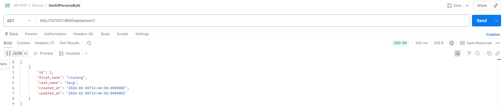

### POST - Crear nueva persona
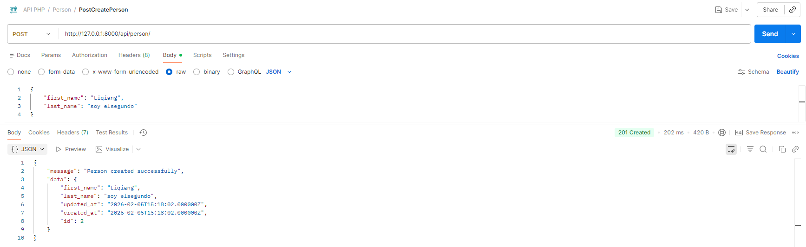

### PUT - Actualizar persona
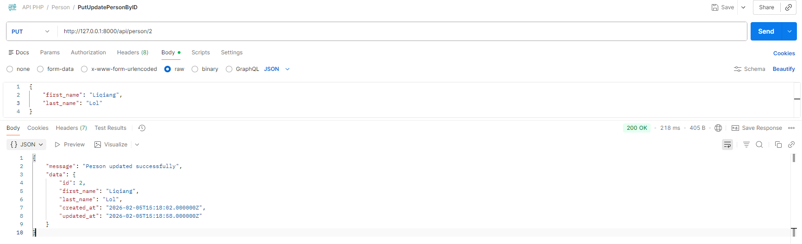

### DELETE - Eliminar persona
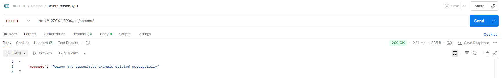

### Errores
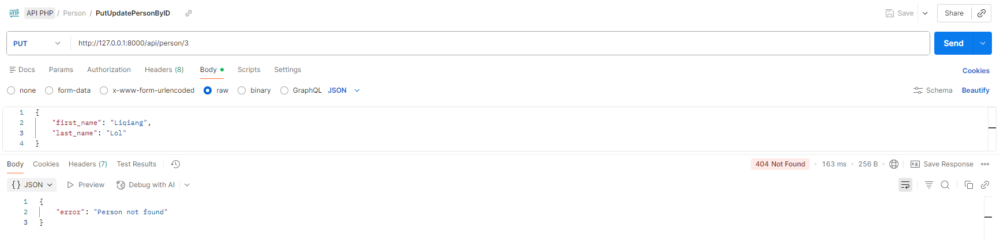

---

## Endpoints de Animales

### GET - Obtener todos los animales
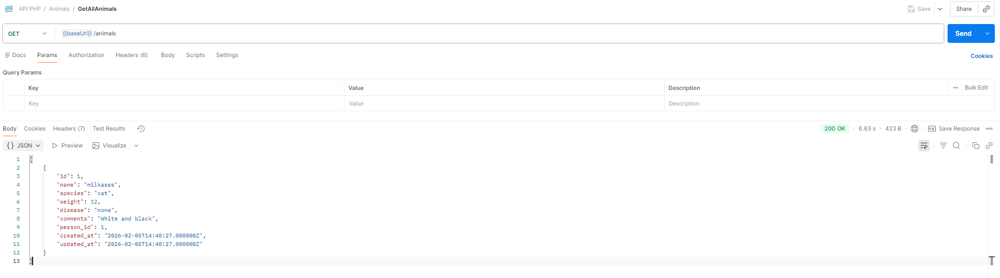

### GET - Obtener animal por ID
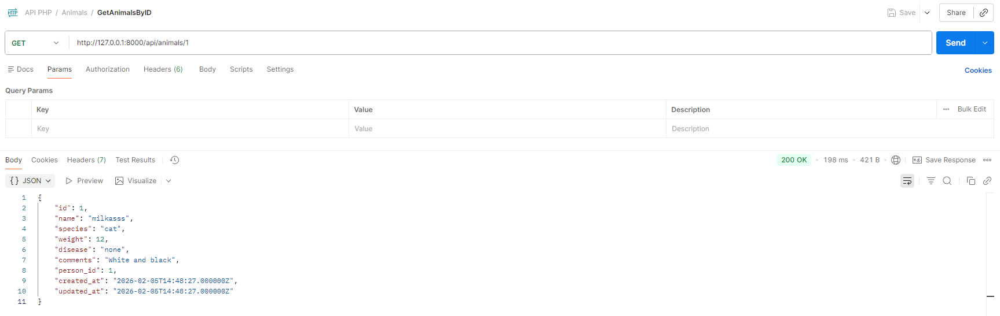

### POST - Crear nuevo animal
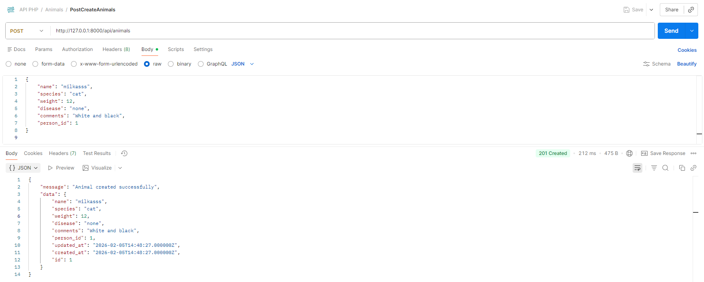

### PUT - Actualizar animal
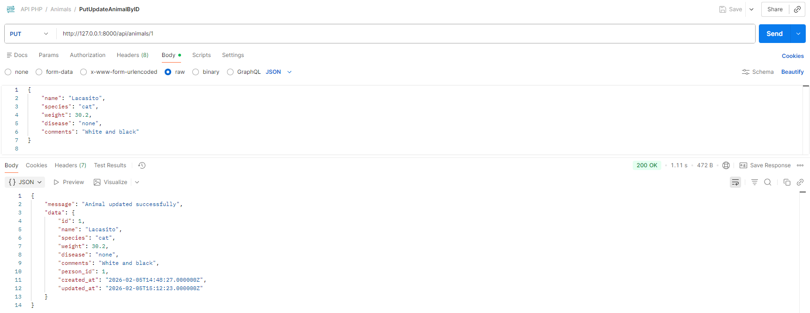

### DELETE - Eliminar animal por ID
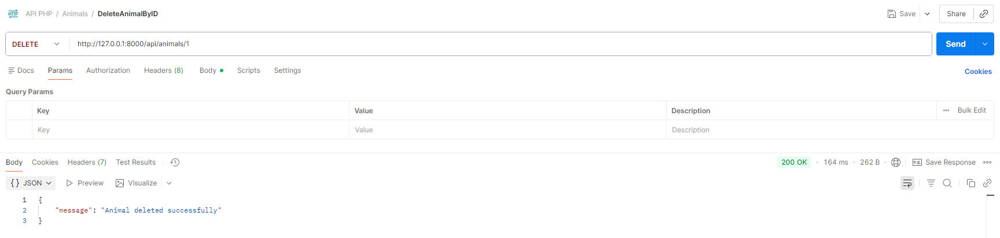

### Errores
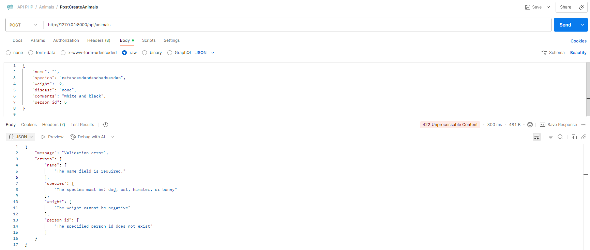

---
